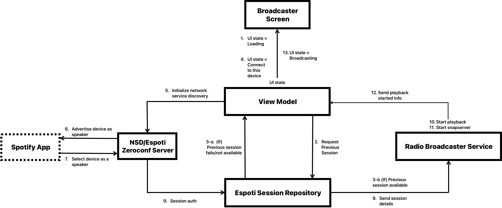

# Project Architecture Overview

## Radio Broadcaster

Below is an architecture diagram of the Radio Broadcaster user flow.

When starting this screen the app will either start advertising the current device as a Spotify speaker or it will look for a previous playback session.
Once the session is established, the app will start a broadcast of the current playback via snapcast.

